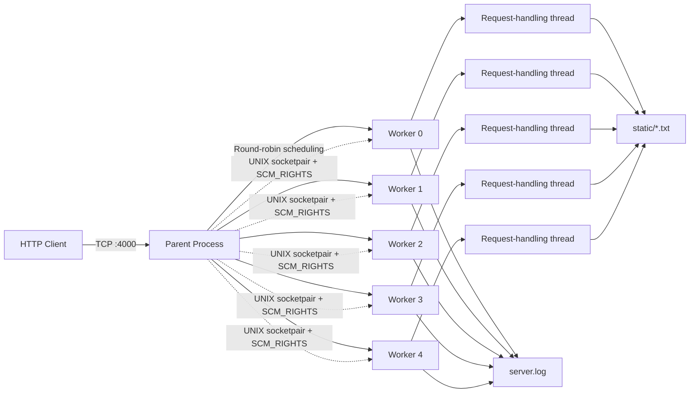

# Concurrent Mini HTTP Server in C

A compact educational HTTP server implemented in **C** for an Operating Systems course project. The server combines processes, POSIX threads, TCP sockets, UNIX-domain socket pairs, file-descriptor passing, synchronization primitives, and round-robin scheduling to handle concurrent `GET` and `POST` requests.

The repository also includes a multithreaded client for generating repeated concurrent `POST` requests.

## Project Overview

The server listens on TCP port `4000`. A parent process accepts incoming client connections and distributes them among five worker processes using round-robin scheduling. Connected client sockets are transferred to workers through UNIX-domain socket pairs with `SCM_RIGHTS`.

Each worker parses the incoming request and handles it as follows:

- `GET /name` reads `./static/name.txt`
- `POST /name` appends the request body to `./static/name.txt`
- Unsupported methods receive a `400 Bad Request` response
- Requests containing `..` in the path are rejected

## Architecture



## Implemented Concepts

- TCP socket programming with `socket`, `bind`, `listen`, `accept`, `connect`, `send`, and `recv`
- Process creation with `fork`
- Five persistent worker processes
- Round-robin client distribution
- Inter-process communication with `socketpair`
- File-descriptor passing with `sendmsg`, `recvmsg`, and `SCM_RIGHTS`
- POSIX threads for request processing
- POSIX semaphores for limiting concurrent `POST` handling within each worker process
- Mutex-protected request logging within each worker process
- Atomic client identifier generation in the parent process
- File-based `GET` and `POST` operations
- Basic path-traversal protection

## Repository Structure

```text
MiniHttpServer/
├── Server.c   # Concurrent server implementation
├── client.c   # Multithreaded POST stress client
└── README.md
```

The server creates `server.log` automatically. The `static` directory must be created manually before running the server.

Recommended local structure:

```text
MiniHttpServer/
├── Server.c
├── client.c
├── README.md
├── server.log
└── static/
    ├── example.txt
    ├── file1.txt
    └── ...
```

## Requirements

This project relies on POSIX APIs and should be compiled on a Unix-like environment such as:

- Linux
- WSL on Windows
- A compatible Unix environment

Required tools:

- GCC or Clang
- POSIX Threads
- POSIX sockets and semaphore support

No third-party libraries are required.

## Build

Compile the server:

```bash
gcc -std=gnu11 -Wall -Wextra -pthread Server.c -o server
```

Compile the test client:

```bash
gcc -std=gnu11 -Wall -Wextra -pthread client.c -o client
```

## Running the Server

Create the directory used for stored text files:

```bash
mkdir -p static
```

Optionally create a sample file:

```bash
echo "Hello from the mini HTTP server." > static/example.txt
```

Start the server:

```bash
./server
```

Expected output:

```text
Server is running on port 4000
```

The server accepts connections on all available interfaces:

```text
0.0.0.0:4000
```

## Request Examples

### GET request

The following request reads `./static/example.txt`:

```bash
curl http://127.0.0.1:4000/example
```

A successful response uses:

```http
HTTP/1.1 200 OK
Content-Type: text/plain
```

Possible GET responses:

| Status | Meaning |
|---|---|
| `200 OK` | The requested text file was found |
| `404 Not Found` | The requested text file does not exist |
| `400 Bad Request` | The path contains a rejected `..` sequence |

### POST request

The following request appends text to `./static/notes.txt`:

```bash
curl -X POST http://127.0.0.1:4000/notes \
  -H "Content-Type: text/plain" \
  --data "A new line written by the client."
```

A successful response uses:

```http
HTTP/1.1 201 Created
Content-Type: text/plain
```

The server divides a multiline request body into separate lines and creates a detached thread for each line.

## Worker Scheduling

The parent process maintains a round-robin counter:

```text
Worker 0 → Worker 1 → Worker 2 → Worker 3 → Worker 4 → Worker 0 → ...
```

For each accepted connection, the parent:

1. Generates a client identifier.
2. selects the next worker.
3. passes the connected TCP socket to that worker.
4. sends the client identifier through the same IPC channel.
5. closes its local copy of the connected socket.

A worker receives the descriptor and processes the HTTP request independently.

## File-Descriptor Passing

Client descriptors cannot be transferred by sending their numeric values alone. The server therefore uses ancillary data over a UNIX-domain socket:

```text
Parent process
    |
    | sendmsg(..., SCM_RIGHTS, client_socket)
    v
Worker process
```

The worker extracts the descriptor using `recvmsg` and then communicates directly with the client.

## Request Logging

Handled requests are appended to:

```text
server.log
```

Each log record contains:

- Timestamp
- HTTP method
- Assigned client ID
- Requested file
- Response status

Example format:

```text
[Mon Jul 20 14:25:30 2026] Method: GET, Client ID: 1, File: /example.txt, Status: 200 OK
```

## Included Stress Client

`client.c` is a multithreaded load generator configured with:

```c
#define SERVER_IP "127.0.0.1"
#define SERVER_PORT 4000
#define NUM_REQUESTS 10
#define REPEAT_COUNT 1000
```

It creates ten client threads. Each thread repeatedly sends `POST` requests to one of these paths:

```text
/file1
/file2
...
/file10
```

Run it in a second terminal after starting the server:

```bash
./client
```

With the current constants, the program attempts to send a total of:

```text
10 threads × 1000 requests = 10,000 POST requests
```

The current client calls `pause()` instead of joining and exiting after its threads finish. Stop it manually with:

```text
Ctrl+C
```

For lighter testing, reduce `REPEAT_COUNT` before compiling.

## Configuration

The principal compile-time settings are located at the top of the source files.

### Server settings

```c
#define BUFFER_SIZE 1024
#define MAX_CLIENTS 10
#define MAX_PROCESSES 5
#define PORT 4000
```

### Client settings

```c
#define SERVER_IP "127.0.0.1"
#define SERVER_PORT 4000
#define BUFFER_SIZE 1024
#define NUM_REQUESTS 10
#define REPEAT_COUNT 1000
```

Recompile the relevant program after changing these values.

## Current Scope

This project is an educational concurrency and operating-systems exercise rather than a production HTTP implementation. It demonstrates the interaction of networking, processes, threads, IPC, scheduling, and synchronization in a compact codebase.

The implementation:

- Handles one request per TCP connection
- Supports only `GET` and `POST`
- Stores and serves `.txt` files
- Reads at most one 1024-byte request buffer
- Returns at most 1023 bytes from a requested file
- Does not implement persistent connections
- Does not provide TLS
- Does not fully parse HTTP headers

## Academic Context

This project demonstrates several core Operating Systems topics:

- Processes and `fork`
- Threads and synchronization
- Inter-process communication
- File-descriptor sharing
- Round-robin scheduling
- Resource coordination
- Network programming
- Concurrent file access
